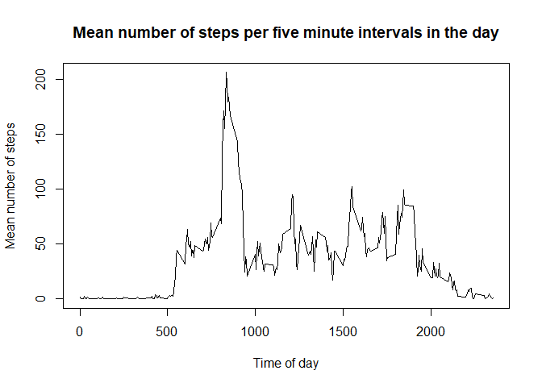
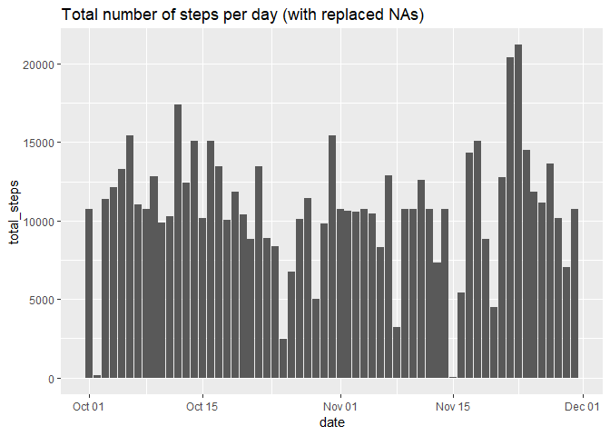
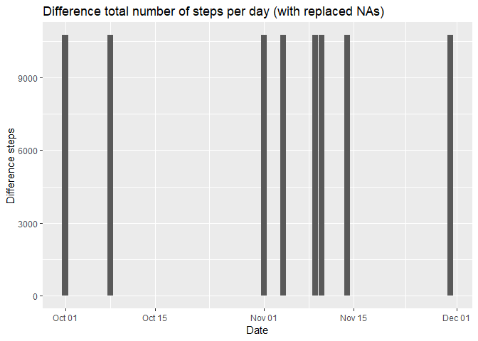

Loading and preprocessing the data
----------------------------------

To load the data I will use the function *read\_csv()* from the *readr*
library to read a zipped csv file.

``` r
# Read  zipped CSV into r
data <- read_csv("activity.zip", col_names = TRUE)
```

    ## Parsed with column specification:
    ## cols(
    ##   steps = col_double(),
    ##   date = col_date(format = ""),
    ##   interval = col_double()
    ## )

``` r
dim(data)
```

    ## [1] 17568     3

``` r
summary(data)
```

    ##      steps             date               interval     
    ##  Min.   :  0.00   Min.   :2012-10-01   Min.   :   0.0  
    ##  1st Qu.:  0.00   1st Qu.:2012-10-16   1st Qu.: 588.8  
    ##  Median :  0.00   Median :2012-10-31   Median :1177.5  
    ##  Mean   : 37.38   Mean   :2012-10-31   Mean   :1177.5  
    ##  3rd Qu.: 12.00   3rd Qu.:2012-11-15   3rd Qu.:1766.2  
    ##  Max.   :806.00   Max.   :2012-11-30   Max.   :2355.0  
    ##  NA's   :2304

What is mean total number of steps taken per day?
-------------------------------------------------

To calculate the total, mean, and median steps per day I will use the
*summarise* function from *dplyr* and graph the histogram with *ggplot*.

``` r
# Get summary statistics by day
basic_stats_by_day <- summarise(group_by(data, date), total_steps=sum(steps), mean_steps=mean(steps, na.rm = TRUE), median_steps=median(steps,na.rm = TRUE))

# Use geom_bar to draw the histogram because data is already in frequency format
ggplot(basic_stats_by_day, aes(x=date,y=total_steps)) + geom_bar(stat = 'identity') +
  ggtitle("Total number of steps per day")
```


``` r
# Print mean and median steps per day, head and tail to save space
head(select(basic_stats_by_day,-(total_steps)))
```

| date       |  mean\_steps|  median\_steps|
|:-----------|------------:|--------------:|
| 2012-10-01 |          NaN|             NA|
| 2012-10-02 |      0.43750|              0|
| 2012-10-03 |     39.41667|              0|
| 2012-10-04 |     42.06944|              0|
| 2012-10-05 |     46.15972|              0|
| 2012-10-06 |     53.54167|              0|

``` r
tail(select(basic_stats_by_day,-(total_steps)))
```

| date       |  mean\_steps|  median\_steps|
|:-----------|------------:|--------------:|
| 2012-11-25 |     41.09028|              0|
| 2012-11-26 |     38.75694|              0|
| 2012-11-27 |     47.38194|              0|
| 2012-11-28 |     35.35764|              0|
| 2012-11-29 |     24.46875|              0|
| 2012-11-30 |          NaN|             NA|

What is the average daily activity pattern?
-------------------------------------------

``` r
# Group steps by 5-minute interval
mean_by_interval <- summarise(group_by(data, interval), mean_steps=mean(steps, na.rm = TRUE))

plot(mean_by_interval$interval, mean_by_interval$mean_steps, type = "l",
     xlab = "Time of day",
     ylab = "Mean number of steps",
     main = "Mean number of seps per five minute intervals in the day")
```



The time of day where the average number of steps is the maximum:

``` r
mean_by_interval$interval[which.max(mean_by_interval$mean_steps)]
```

    ## [1] 835

Imputing missing values
-----------------------

First, we need to know how many incomplete cases (rows with NAs) we
have:

``` r
sum(!complete.cases(data))
```

    ## [1] 2304

This number matches with the number of NAs in the *steps* column,
displayed at the beginning of this document while summarising the data.

Given that it is only *steps* column that has missing values, I will use
the mean number of steps by interval to replace the NAs.

``` r
data_complete <- data
indices_na <- which(is.na(data_complete$steps))

for(i in indices_na) {
  inter <- data_complete$interval[i]
  mn <- mean_by_interval$mean_steps[mean_by_interval$interval == inter]
  data_complete[i,1] <- round(mn,digits = 0)
}
```

I will present a summary of the new data frame with the NAs replaced.

``` r
# Get summary statistics by day
basic_stats_by_day_no_nas <- summarise(group_by(data_complete, date), total_steps=sum(steps), mean_steps=mean(steps), median_steps=median(steps))

# Draw the histogram
ggplot(basic_stats_by_day_no_nas, aes(x=date,y=total_steps)) + geom_bar(stat = 'identity') +
  ggtitle("Total number of steps per day (with replaced NAs)")
```



``` r
# Print mean and median steps per day, head and tail to save space
head(select(basic_stats_by_day_no_nas,-(total_steps)))
```

| date       |  mean\_steps|  median\_steps|
|:-----------|------------:|--------------:|
| 2012-10-01 |     37.36806|           34.5|
| 2012-10-02 |      0.43750|            0.0|
| 2012-10-03 |     39.41667|            0.0|
| 2012-10-04 |     42.06944|            0.0|
| 2012-10-05 |     46.15972|            0.0|
| 2012-10-06 |     53.54167|            0.0|

``` r
tail(select(basic_stats_by_day_no_nas,-(total_steps)))
```

| date       |  mean\_steps|  median\_steps|
|:-----------|------------:|--------------:|
| 2012-11-25 |     41.09028|            0.0|
| 2012-11-26 |     38.75694|            0.0|
| 2012-11-27 |     47.38194|            0.0|
| 2012-11-28 |     35.35764|            0.0|
| 2012-11-29 |     24.46875|            0.0|
| 2012-11-30 |     37.36806|           34.5|

I will now calculate the impact on the total number of steps taken per
day.

``` r
basic_stats_by_day_diff <- basic_stats_by_day

# Repalce NAs with zeroes
basic_stats_by_day_diff[is.na(basic_stats_by_day_diff)] <- 0

# Finde difference between total number of steps per day
basic_stats_by_day_diff <- mutate(basic_stats_by_day_diff, diff = basic_stats_by_day_no_nas$total_steps - total_steps)

# Draw the histogram
ggplot(basic_stats_by_day_diff, aes(x=date,y=diff)) + geom_bar(stat = 'identity') + labs(x="Date",y="Difference steps") +
  ggtitle("Difference total number of steps per day (with replaced NAs)")
```



``` r
mean(basic_stats_by_day$total_steps, na.rm = TRUE)
```

    ## [1] 10766.19

``` r
mean(basic_stats_by_day_no_nas$total_steps, na.rm = TRUE)
```

    ## [1] 10765.64

The strategy used to repalace NAs has a minimal impact on total steps
per day and on the average of total steps per day. Only eight days are
affected (days when there were no measurements) and this had a minimal
effect on the average.

Are there differences in activity patterns between weekdays and weekends?
-------------------------------------------------------------------------
