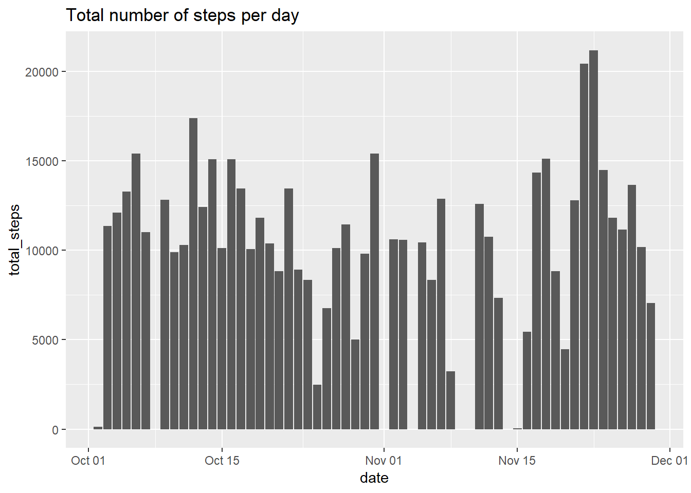

## Loading and preprocessing the data

To load the data I will use the function *read_csv()* from the *readr* library to read a zipped csv file.


```r
# Read  zipped CSV into r
data <- read_csv("activity.zip", col_names = TRUE)
```

```
## Parsed with column specification:
## cols(
##   steps = col_double(),
##   date = col_date(format = ""),
##   interval = col_double()
## )
```

```r
dim(data)
```

```
## [1] 17568     3
```

```r
summary(data)
```

```
##      steps             date               interval     
##  Min.   :  0.00   Min.   :2012-10-01   Min.   :   0.0  
##  1st Qu.:  0.00   1st Qu.:2012-10-16   1st Qu.: 588.8  
##  Median :  0.00   Median :2012-10-31   Median :1177.5  
##  Mean   : 37.38   Mean   :2012-10-31   Mean   :1177.5  
##  3rd Qu.: 12.00   3rd Qu.:2012-11-15   3rd Qu.:1766.2  
##  Max.   :806.00   Max.   :2012-11-30   Max.   :2355.0  
##  NA's   :2304
```


## What is mean total number of steps taken per day?


```r
# Get summary statistics by day
basic_stats_by_day <- summarise(group_by(data, date), total_steps=sum(steps), mean_steps=mean(steps, na.rm = TRUE), median_steps=median(steps,na.rm = TRUE))

# Use geom_bar to draw the histogram because data is already in frequency format
ggplot(basic_stats_by_day, aes(x=date,y=total_steps)) + geom_bar(stat = 'identity') +
  ggtitle("Total number of steps per day")
```

<!-- -->


```r
# Print mean and median steps per day, head and tail to save space
head(select(basic_stats_by_day,-(total_steps)))
```


date          mean_steps   median_steps
-----------  -----------  -------------
2012-10-01           NaN             NA
2012-10-02       0.43750              0
2012-10-03      39.41667              0
2012-10-04      42.06944              0
2012-10-05      46.15972              0
2012-10-06      53.54167              0

```r
tail(select(basic_stats_by_day,-(total_steps)))
```


date          mean_steps   median_steps
-----------  -----------  -------------
2012-11-25      41.09028              0
2012-11-26      38.75694              0
2012-11-27      47.38194              0
2012-11-28      35.35764              0
2012-11-29      24.46875              0
2012-11-30           NaN             NA


## What is the average daily activity pattern?


## Imputing missing values


## Are there differences in activity patterns between weekdays and weekends?
